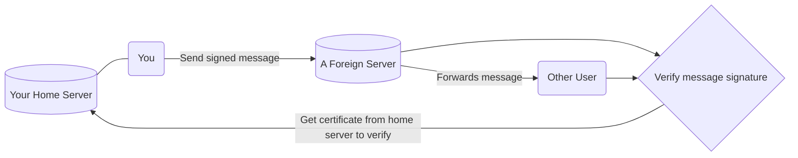

# An Overview of polyproto

:::warning "Work in Progress"

This overview page is not yet finished. However, what's there is already representative of
what the polyproto protocol is about.

:::

polyproto is a federated identity and message exchange protocol that can be used for almost
anything. If you'd like to build an application that prioritizes federation, user control,
and data integrity, then polyproto is most likely for you. Read this overview to get to know
the core concepts and technologies the protocol uses.

## Identity

A user's identity is always represented by a Federation ID (FID). Conceptually, FIDs are
nothing new, and they look like this:

`xenia@some.example.com`

Everything after the `@` is your Home Servers' domain, and the part before the `@` is your username.
Together, these form an individual, yet globally unique, identifier.

## Certificates and Keys

Identity Certificates (ID-Certs) represent your identity when logged in on different
sessions. Each Identity Certificate contains the following information:

- Your FID, to uniquely identify your account.
- A session ID, which is unique for each session and does not change, even if the keys change.
- An expiry date, after which the certificate becomes invalid.
- A signature generated by your home server, which acts as part of the proof that this certificate
  was actually issued by your home server.
- Some information from your home server, including the server's domain and the certificate serial number.
- Information about the signature algorithm your home server uses.

and, last but not least:

- The client's public identity key.

For the sake of this overview, the most important parts here are the **client public identity key**,
your **federation ID**, the **home server's domain** and the **home server's signature for this
certificate**.

## Message signing

When you, for example, chat with someone on a different server, that other server is fully in
control of what data it chooses to present to you. To make sure that this server is always
telling you the truth, and not, for example, sending you fake chat messages or social media posts,
messages are signed using a client's public identity key.

This is how it works:

- As touched on previously, every user client has an own identity key pair, comprised of a public
  and a private key. The public key is cryptographically linked to the private key, meaning that
  this public key can belong to only this specific private key. Data is signed using the private key,
  which ONLY the client knows. Everyone can then use your public key to prove that this signature
  was generated by your client, and that the signature matches the data that was signed.
- Signatures are unique to a piece of data, meaning that two differing pieces of data signed by the
  same or different private keys will always[^1] produce different signatures. This is true
  even if the data only differs minutely (even by a single space, or a single comma).
- Your home server attests to a clients' key pair by creating a certificate for your public key,
  which it signs with its own secret public/private key pair, and then sends to you. Your _private_
  key is never sent anywhere at all, and it doesn't need to be.

[^1]:
    Signature/hash collisions are theoretically possible, but extraordinarily infrequent
    and thus, negligible in practical scenarios.

Now, your public identity key and your home server's identity key are 'linked' to each other. This
is represented in the ID-Cert you then receive from your home server.

- When communicating with another "foreign" server in polyproto, you first send that server your
  ID-Cert. The server can then prove the validity of your identity, simply by asking your home
  server for its public key and performing a quick signature verification.
- When sending data to the server, such as chat messages, your client computes the signature for
  that message using your private key, and attaches this signature to the message you send to other
  servers.
- Any user, at any point, can now take this signature, your identity certificate, and your home
  servers' public key and cryptographically verify that it was, in fact, you who sent the message,
  and that the message was not tampered with in any way. To distribute the load of ID-Cert requests
  more evenly, the server that the data exchange is happening on is responsible for caching and handing
  out users' ID-Certs.

:::info

If you're interested in the details, feel free to jump to
[section 6.1 in the protocol](protocols/core/#61-home-server-signed-certificates-for-public-client-identity-keys-id-cert)
specification document, which covers this exact thing and more.

:::

## Trust

Trusting the smallest possible number of entities is great practice when it comes to security.
polyproto makes sure that almost everyone you do trust is under constant scrutiny, and thus provides
measures to verify a data authors' identity, and that the actual data has not been tampered with.

Aside from yourself, the entity with the most trust assigned to it is your home server. Creating
your identity on a specific home server is a pledge from that server and its admins to you, in which
they promise not to create sessions on your behalf, or to otherwise perform actions which can be
publicly identified to be carried out by you, without your explicit consent.

If you ever decide your home server is no longer trustworthy, you can always migrate to
another server while keeping the ownership status of your data on all servers you have sent data to,
even if your home server is offline indefinitely.

## Multi-use

polyprotos' API definitions and specification document intentionally leave space for
implementation-specific data to be sent, where it makes sense. Nothing about the core protocol makes
polyproto inherently unsuitable for any purpose.

## Federation

Federation in polyproto means using one identity or client to interact with multiple servers or even
services at once. Implementing federation is straightforward, and entirely seamless to use for end
users.

## Technology

Probably the most refreshing aspect about this new protocol is that it's really boring. There's
really nothing new about any given atomic aspect of polyproto. Polyproto uses well-known, tried and
battle-tested technologies, such as asymmetric encryption, X.509-based public key infrastructure and
-certificates, digital signatures, JSON over REST and other well-established technologies
such as WebSockets.

polyproto should be effortless both for developers and for end users, who, ideally, should never
have to notice any of the technical stuff going on in the background.

## Conclusion

This is just an outline of how polyproto works. Some details have been left out to keep this
outline clearer and focus on the most important parts of the protocol. If you have read and
understood this overview, you should have no - or at least way less - trouble reading
the [full protocol specification](protocols/core/), which covers a lot more details!
